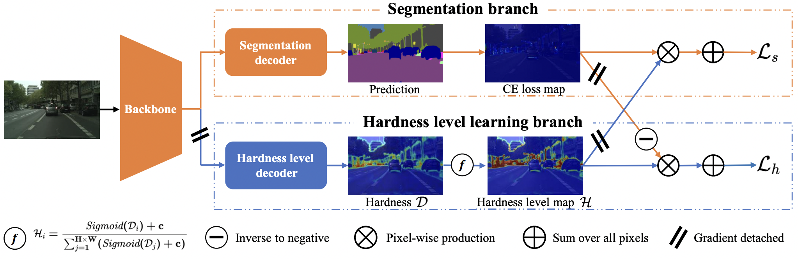
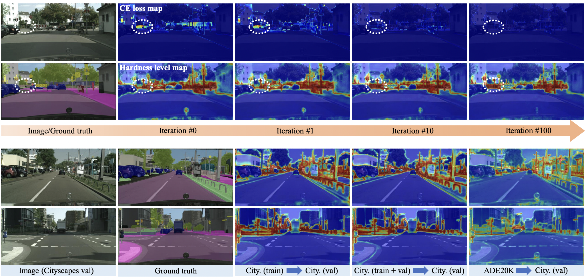

# Not All Pixels Are Equal: Learning Hardness Probability for Semantic Segmentation 
### [Paper](https://arxiv.org/abs/2108.07774)
## Official PyTorch Implementation
Xin Xiao, Daiguo Zhou, Jiagao Hu, Yi Hu and [Yongchao Xu](https://sites.google.com/view/yongchaoxu)


>**abstract:**
>—Semantic segmentation has recently witnessed great progress. Despite the impressive overall results, the segmentation
performance in some hard areas (e.g., small objects or thin parts) is still not promising. A straightforward solution is hard sample
mining, which is widely used in object detection. Yet, most existing hard pixel mining strategies for semantic segmentation often rely
on pixel’s loss value, which tends to decrease during training. Intuitively, the pixel hardness for segmentation mainly depends on image
structure and is expected to be stable. In this paper, we propose to learn pixel hardness for semantic segmentation, leveraging hardness
information contained in global and historical loss values. More precisely, we add a gradient-independent branch for learning a hardness
level (HL) map by maximizing hardness-weighted segmentation loss, which is minimized for the segmentation head. This encourages
large hardness values in difficult areas, leading to appropriate and stable HL map. Despite its simplicity, the proposed method can
be applied to most segmentation methods with no and marginal extra cost during inference and training, respectively. Without bells
and whistles, the proposed method achieves consistent/significant improvement (1.37% mIoU on average) over most popular semantic
segmentation methods on Cityscapes dataset, and demonstrates good generalization ability across domains.



## Usage
To reproduce the results in the paper, we recommend to follow the instructions below.
Other versions of Pytorch and mmcv are not tested, but it may work. 
### Requirements
- Pytorch == 1.8.2
- mmcv-full == 1.4.5

## Getting started 
### 1. Install dependencies

**Step 1**: Create a conda environment and activate it.
```bash
conda create -n HardnessLevel python=3.7
conda activate HardnessLevel
```

**Step 2**: Install PyTorch and torchvision
```bash
pip3 install torch==1.8.2 torchvision==0.9.2 --extra-index-url https://download.pytorch.org/whl/lts/1.8/cu111
```

**Step 3**: Install mmcv-full
```bash
pip install -U openmim 
mim install mmcv-full==1.4.5
pip3 install matplotlib numpy packaging prettytable cityscapesscripts
```

### 2. Data preparation
```bash
cd mmsegmentation
mkdir data
```
Please follow the instructions of [_**mmsegmentation**_](https://mmsegmentation.readthedocs.io/zh_CN/latest/dataset_prepare.html) for data preparation.


### 3. Training

For instance, training PSPNet-ResNet101 with HL on Cityscapes with 4 GPUs by:

```
bash ./tools/dist_train.sh configs/pspnet_hl/pspnet_r101-d8_769x769_40k_cityscapes_hl.py 4
```

### 4. Testing
For instance, test PSPNet-ResNet101 with HL on Cityscapes with 4 GPUs by:

```bash
bash ./tools/dist_test.sh  configs/pspnet_hl/pspnet_r101-d8_769x769_40k_cityscapes_hl.py /path/pspnet.pth 4 --eval mIoU
```
[_**BaiduNet Disk**_](https://pan.baidu.com/s/1qQgqc_itFfDJmnikfO6FOg) (jahh) [_**Google Driver**_](https://drive.google.com/file/d/1KZzGROE13ZEmsybkFYTowYW4gv1oCiHa/view?usp=share_link).
Note that you should replace ```/path/pspnet.pth``` with the path you store the pth file. You are
supposed to get **_80.65_** mIoU on val set. 

## Results
Training logs can be found [_**here**_](logs/). Experiments are implemented on a device with 8 A100-40GB GPUs.

## Extensions
### 1. Domain generation semantic segmentation
Evaluate the performance for GTAV -> Cityscapes domain generation by:
```bash
bash ./tools/dist_test.sh  configs/gta_hl/deeplab_gta2city_res101_hl.py /path/gta_hl.pth 4 --eval mIoU
```

[_**BaiduNet Disk**_](https://pan.baidu.com/s/1mRWdmM9jVFdjRrzhXzUj_w)(ujra) [_**Google Driver**_](https://drive.google.com/file/d/1zsbfnyKIliK0_UBD2hOj3ZMY8_h5_n_t/view?usp=share_link).
Note that you should replace ```/path/gta_hl.pth``` with the path you store the pth file. You are
supposed to get **_43.06_** mIoU on val set. 
Please refer to  [_**DAFormer**_](https://github.com/lhoyer/DAFormer) for more details.


### 2. Semi-supervised semantic segmentation
Cityscapes: results are obtained by DeepLabv3+ with ResNet-101 backbone.

|                             ResNet-101                             |   1/16   |   1/8    |  1/4     |   1/2    |
|:------------------------------------------------------------------:|:--------:|:--------:|:--------:|:--------:|
|                              SupOnly                               |   65.7   |   72.5   |   74.4   |   77.8   |
| [U<sup>2</sup>PL](https://github.com/Haochen-Wang409/U2PL) (paper) |   70.3   |   74.4   |   76.5   |   79.1   |
|                    U<sup>2</sup>PL (reproduced)                    |   71.1   |   75.2   |   75.9   |   78.4   |
|                      **U<sup>2</sup>PL + HL**                      | **72.6** | **76.0** | **76.6** | **79.6** |
|     [UniMatch](https://github.com/LiheYoung/UniMatch) (paper)      |   75.7   |   77.3   |   78.7   |    _     |
|                         **UniMatch + HL**                          | **76.2** | **78.2** | **78.9** |    _     |

Note: The results of UniMatch are obtained by the ORIGINAL VERSION (NOT CVPR2023).

## License
This project is released under the [_**Apache 2.0**_](LICENSE) license.

## Acknowledgment
This code is built using [**_mmsegmentation_**](https://github.com/open-mmlab/mmsegmentation) repositories.
Thanks a lot for their great work!

## Citation
```bibtex
@inproceedings{yang2018denseaspp,
  title={Not All Pixels Are Equal: Learning Hardness Probability for Semantic Segmentation},
  author={Xin Xiao, Daiguo Zhou, Jiagao Hu, Yi Hu and Yongchao Xu},
}
```

